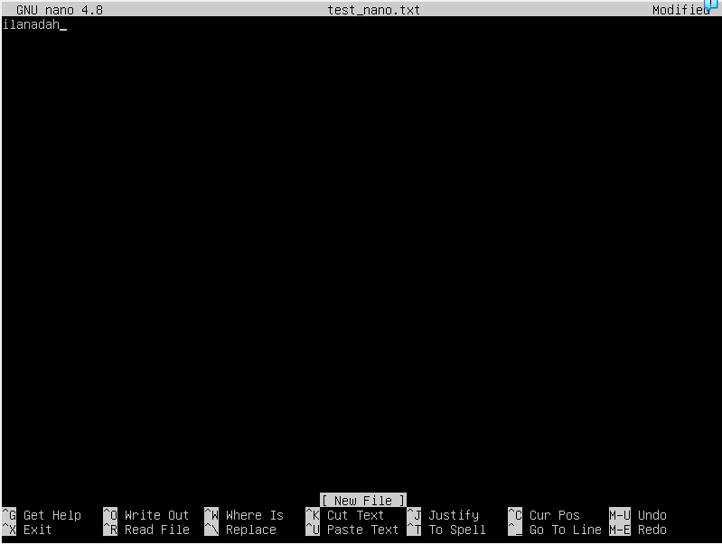
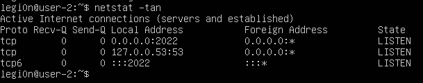

## Part 1. Установка ОС

Рис 1. Вывод команды cat

## Part 2. Создание пользователя

Рис 2. Вывод при создании пользователя

Рис 3. Вывод команды cat

## Part 3. Настройка сети ОС

### Задать названием машины вида user-1
+ Открыть файл /etc/hostname текстовым редактором и заменить старое имя на новое.
+ Открыть файл /etc/hosts текстовым редактором и заменить старое имя на новое.
+ Перезагрузить машину для применения изменений командой reboot.

### Установка временной зоны
+ Для изменения текущего значения можно выполнить команду sudo dpkg-reconfigure tzdata и выбрать нужную зону.

### Вывод сетевых интерфейсов
+ Для вывода сетевых интерфейсов можно использовать команду ip link
+ lo (loopback device) – виртуальный интерфейс, присутствующий по умолчанию в любом Linux. Он используется для отладки сетевых программ и запуска серверных приложений на локальной машине. С этим интерфейсом всегда связан адрес 127.0.0.1. У него есть dns-имя – localhost.

### Получение ip адреса
+ Для получения ip адреса от DHCP можно выполнить команду sudo dhclient <имя_интерфейса>.
+ DHCP (англ. Dynamic Host Configuration Protocol — протокол динамической настройки узла) — сетевой протокол, позволяющий сетевым устройствам автоматически получать IP-адрес и другие параметры, необходимые для работы в сети TCP/IP.

### ip адрес шлюза
+ Для определения ip адреса можно выполнить команду hostname -I. 
+ Узнать  внутренний ip адрес шлюза, он же ip адрес по умолчанию (gw) можно при помощи команды ip route. Нужный адрес будет указан в строке defaut via <ip арес шлюза> dev <имя_интерфейса>.

### Задать статичные настройки
+ Текстовым редактором открыть файл конфигураций рассположенный в /etc/netplan/<имя_файла>.yaml
+ Внести изменения по примеру изображения ниже

Рис 4. Настройки сети

### Проверка изменения настроек
+ Командой hostname -I убедиться, что ip адрес совпадает с ip адресом установленным на предыдущем шаге.
+ Командой ip route убедиться, что ip адрес шлюза совпадает с установленным на предыдущем шаге.
+ Командой ping -c 5 1.1.1.1 убедиться, что устанавливается соединиени с DNS сервером
+ Командой ping -c 5 8.8.8.8 убедиться, что устанавливается соединиени с DNS сервером
+ Командой ping -c 5 ya.ru убедиться, что устанавливается соединиени с ya.ru

Рис 5. Вывод команды ping для 1.1.1.1

Рис 6. Вывод команды ping для 8.8.8.8

Рис 7. Вывод команды ping для ya.ru

## Part 4. Обновление ОС

Рис 8. Вывод результата на запрос обновления

## Part 5. Использование команды **sudo**

+ sudo (англ. Substitute User and do, дословно «подменить пользователя и выполнить») — программа для системного администрирования UNIX-систем, позволяющая делегировать те или иные привилегированные ресурсы пользователям с ведением протокола работы.

Рис 9. Выданы права на sudo

Рис 10. Новое имя машины

## Part 6. Установка и настройка службы времени

Рис 11. Вывод команды timedatectl show

## Part 7. Установка и использование текстовых редакторов 

### Выход с сохранением

+ Для выхода из VIM с сохранением можно набрать команду :wq

Рис 12. Выход с сохранением VIM

+ Для выхода из NANO с сохранением нужно нажать Ctrl+O->Enter->Ctrl+X

Рис 13. Выход с сохранением NANO

+ Для выхода из JOE с сохранением нужно нажать Ctrl+K->X

Рис 14. Выход с сохранением JOE

### Выход без сохранения

+ Для выхода из VIM без сохранениея можно набрать команду :q!

Рис 15. Выход без сохранения VIM

+ Для выхода из NANO без сохранениея нужно нажать Ctrl+X->N

Рис 16. Выход без сохранения NANO

+ Для выхода из JOE без сохранениея нужно нажать Ctrl+С->Y

Рис 17. Выход без сохранения JOE

### Поиск и замена

+ Для поска в VIM нужно набрать /<искомый текст>

Рис 18. Поиск в VIM

+ Для замены в VIM нужно набрать :s/<искомый текст>/<текст замены>

Рис 19. Замена в VIM

+ Для поиска в NANO нужно нажать Ctrl+W

Рис 20. Поиск в NANO

+ Для замены в NANO нужно нажать Ctrl+\

Рис 21. Замена в NANO

+ Для поиска в JOE нужно нажать Ctrl+K->F

Рис 22. Поиск в JOE

+ Для замены в JOE нужно нажать Ctrl+K->F->R

Рис 23. Замена в JOE

## Part 8. Установка и базовая настройка сервиса **SSHD**

### Установить службу SSHd.
+  Для установки службы SSHd нужно выполнить команду sudo apt install openssh-server

### Добавить автостарт службы при загрузке системы.
+ После установки автостарт службы уже был включен. Проверить это мжно при помощи команыд systemctl status sshd. Для включения службы можно использовать команду sudo systemctl enable ssh. Она запускает как ssh так и sshd службы.

### Перенастроить службу SSHd на порт 2022.
+ Для смены порта нужно открыть в текстовом редакторе файл /etc/ssh/sshd_config, убрать знак #, если есть, на против слова Port и заменить порт на нужный.
+ Для того, что бы принять изменения нужно перезапустить службу командой sudo systemctl restart sshd.

### Использование команды ps

+ ps -C sshd. Команда ps позволяет вывести процессы. Ключ -С позволяет выбирать процессы по имени команды.

Рис 24. Вывод команды netstat

+ Ключ a показывает состояние всех сокетов; обычно сокеты, используемые серверными процессами, не показываются.
+ Ключ n показывает сетевые адреса как числа. netstat обычно показывает адреса как символы. Эту опцию можно использовать с любым форматом показа.
+ Ключ t показывает сокеты tcp протокола.
+ Proto - протокол используемый сокетом.
+ Resv-Q - количество байт, не скопированных пользовательской программой, подключенной к этому сокету. 
+ Send-Q - количество байт, не подтвержденных удаленным хостом.
+ Local Address - aдрес и номер порта локального конца сокета. Если не указан параметр --numeric ( -n ), адрес сокета преобразуется в его каноническое имя хоста (FQDN), а номер порта преобразуется в соответствующее имя службы.
+ Foreign Address - aдрес и номер порта удаленного конца сокета. Аналогичен «Локальному адресу».
+ State - состояние сокета.
+ IP-адрес 0.0.0.0 обозначает различные варианты использования в разных местах. Обычно это не маршрутизируемый мета-адрес, который не привязан к какому-либо конкретному удаленному адресу. На серверных машинах он подразумевает все адреса IPv4 на локальном компьютере. В контексте ввода маршрута это обычно означает маршрут по умолчанию.

### Перезагрузить систему
+ для перезапуска системы можно использовать команду reboot

## Part 9. Установка и использование утилит **top**, **htop**

Рис 25. Вывод команды top

+ uptime: 16 min
+ количество авторизованных пользователей: 1 user
+ общая загрузка системы: 0,00 1 миниту назад; 0,01 5 минут назад; 0,02 15 минут назад
+ общее количество процессов: 95 total
+ загрузку cpu: 100 - 99,3 = 0,7%
+ загрузку памяти: 7,5% 
+ pid процесса занимающего больше всего памяти: 1
+ pid процесса, занимающего больше всего процессорного времени: 1

Рис 26. Сортировка по PID

Рис 27. Сортирова по CPU 

Рис 28. Сортировка по MEM

Рис 29. Сортировка по TIME

Рис 30. Фильтр для процесса sshd

Рис 31. Поиск процесса syslog

Рис 32. Добавлены выводы hostname, uptime, time

## Part 10. Использование утилиты **fdisk**

+ Название жесткого диска: VBOX HARDDISK
+ Размер жесткого диска  : 25 GiB
+ Количество секторов    : 5242800
+ Размер swap		 : нет информации

## Part 11. Использование утилиты **df** 

+ размер раздела		: 11758760 КiB
+ размер занятого пространства	: 4883496 КiB
+ размер свободного пространства: 6526156 КiB
+ процент использования		: 44%

+ размер раздела		: 12 G
+ размер занятого пространства	: 4.7 G
+ размер свободного пространства: 6.0 G
+ процент использования		: 44%
+ файловая система ext4

## Part 12. Использование утилиты **du**

Рис 33. Вывод команды du

Рис 34. Вывод команды du для папки /home

Рис 35. Вывод команды du для папки /var

Рис 36. Вывод команды du для папки /var/log

Рис 37. Вывод команды du для всех вложений

## Part 13. Установка и использование утилиты **ncdu**

Рис 38. Вывод команды ncdu для папки /home

Рис 39. Вывод команды ncdu для папки /var

Рис 40. Вывод команды ncdu для папки /var/log

## Part 14. Работа с системными журналами

+ время последней успешной авторизации	: 21:10:36
+ имя пользователя 			: legi0n
+ метод входа в систему			: ввод логина/пароля

Рис 41. Перезапуск sshd

## Part 15. Использование планировщика заданий **CRON**

Рис 42. Выполнение cron каждые 2 минуты

Рис 43. Список задач cron до удалния

Рис 44. Список задач cron после удаления
